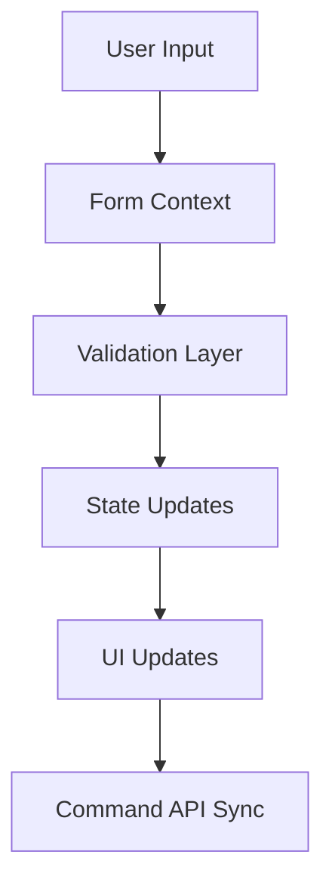

# Real Estate Transaction Form: Technical Architecture

## Core Architecture Overview

The form system implements a modular, event-driven architecture optimized for complex real estate transactions. Key architectural components ensure data integrity, state management, and seamless user experience.

### State Management Flow


## Implementation Components

### 1. Form State Container

The state container implements a centralized store with immutable updates and type-safe access patterns.

```typescript
// src/forms/core/FormContainer.tsx
interface FormContainerProps {
  initialData?: Partial<TransactionData>;
  onSubmit: (data: TransactionData) => Promise<void>;
}

export const FormContainer: React.FC<FormContainerProps> = ({
  initialData,
  onSubmit
}) => {
  /**
   * Initialize form state with validation and persistence
   * Implements optimistic updates with rollback capability
   */
  const [state, dispatch] = useReducer(formReducer, {
    data: getInitialState(initialData),
    metadata: {
      currentStep: 0,
      completedSteps: [],
      errors: {},
      touched: {},
      isDirty: false
    }
  });

  /**
   * Handle form submission with validation and error recovery
   * @throws {ValidationError} If form validation fails
   * @throws {SubmissionError} If API submission fails
   */
  const handleSubmit = async (e: React.FormEvent) => {
    e.preventDefault();
    dispatch({ type: 'START_SUBMIT' });

    try {
      // Validate entire form before submission
      const validationResult = await validateForm(state.data);
      if (!validationResult.isValid) {
        throw new ValidationError('Form validation failed', validationResult.errors);
      }

      // Transform data for Command API
      const commandPayload = transformForCommand(state.data);
      
      // Optimistic update
      dispatch({ type: 'SET_STATUS', status: 'submitting' });
      
      await onSubmit(commandPayload);
      
      dispatch({ type: 'COMPLETE_SUBMIT' });
    } catch (error) {
      dispatch({ type: 'SET_ERROR', error });
      handleSubmissionError(error);
    }
  };

  return (
    <FormProvider value={{ state, dispatch }}>
      <form onSubmit={handleSubmit} className="transaction-form">
        <FormSections />
        <FormNavigation />
        <FormErrors />
      </form>
    </FormProvider>
  );
};
```

### 2. Field Management System

Implements a robust field management system with intelligent updates and validation.

```typescript
// src/forms/hooks/useField.ts
interface FieldConfig<T> {
  validate?: (value: T) => string | undefined;
  transform?: (value: T) => any;
  dependencies?: string[];
}

export function useField<T>(
  name: string,
  config: FieldConfig<T>
) {
  const { state, dispatch } = useForm();
  const value = get(state.data, name) as T;

  /**
   * Handle field updates with validation and transformation
   * Implements debouncing for performance optimization
   */
  const handleChange = useCallback(async (newValue: T) => {
    // Transform value if transformer provided
    const transformedValue = config.transform?.(newValue) ?? newValue;
    
    // Update field value
    dispatch({
      type: 'SET_FIELD',
      field: name,
      value: transformedValue
    });

    // Validate if validator provided
    if (config.validate) {
      const error = await config.validate(transformedValue);
      if (error) {
        dispatch({
          type: 'SET_ERROR',
          field: name,
          error
        });
      } else {
        dispatch({
          type: 'CLEAR_ERROR',
          field: name
        });
      }
    }

    // Update dependent fields if any
    if (config.dependencies) {
      await updateDependentFields(
        config.dependencies,
        transformedValue,
        state.data
      );
    }
  }, [name, config, dispatch, state.data]);

  return {
    value,
    onChange: handleChange,
    error: state.metadata.errors[name],
    touched: state.metadata.touched[name]
  };
}
```

### 3. Document Management Integration

Implements comprehensive document tracking and validation system.

```typescript
// src/forms/services/DocumentManager.ts
export class DocumentManager {
  private readonly requiredDocs: Map<AgentRole, DocumentRequirement[]>;

  constructor(commandApi: CommandAPIClient) {
    this.commandApi = commandApi;
    this.initializeRequirements();
  }

  /**
   * Get required documents based on transaction context
   * @param context Current transaction context
   * @returns List of required document definitions
   */
  async getRequiredDocuments(
    context: TransactionContext
  ): Promise<DocumentRequirement[]> {
    const baseRequirements = this.requiredDocs.get(context.agentRole) || [];
    
    // Add contextual requirements
    const additionalRequirements = await this.getContextualRequirements(context);
    
    return [...baseRequirements, ...additionalRequirements];
  }

  /**
   * Validate document completeness and integrity
   * @param documents List of submitted documents
   * @param context Current transaction context
   * @returns Validation result with any missing requirements
   */
  async validateDocuments(
    documents: SubmittedDocument[],
    context: TransactionContext
  ): Promise<ValidationResult> {
    const requirements = await this.getRequiredDocuments(context);
    
    const missing = requirements.filter(req => {
      const submitted = documents.find(doc => doc.type === req.type);
      return !submitted || !this.validateDocument(submitted, req);
    });

    return {
      isValid: missing.length === 0,
      missing,
      details: this.generateValidationDetails(missing)
    };
  }

  /**
   * Validate individual document against requirements
   * @param document Submitted document
   * @param requirement Document requirement definition
   * @returns Whether document satisfies requirements
   */
  private validateDocument(
    document: SubmittedDocument,
    requirement: DocumentRequirement
  ): boolean {
    if (!document.content) {
      return false;
    }

    // Validate document metadata
    if (!this.validateMetadata(document, requirement)) {
      return false;
    }

    // Validate document signatures if required
    if (requirement.requiresSignature && !document.signatures?.length) {
      return false;
    }

    // Additional custom validations
    return this.runCustomValidations(document, requirement);
  }
}
```

## State Flow Patterns

### Command Pattern Implementation

The form implements a command pattern for state updates, ensuring atomic operations and maintainable state transitions.

```typescript
// src/forms/commands/formCommands.ts
abstract class FormCommand {
  abstract execute(state: FormState): FormState;
  abstract undo(state: FormState): FormState;
}

class UpdateFieldCommand extends FormCommand {
  constructor(
    private field: string,
    private value: any,
    private previousValue: any
  ) {
    super();
  }

  execute(state: FormState): FormState {
    return {
      ...state,
      data: setIn(state.data, this.field, this.value),
      metadata: {
        ...state.metadata,
        touched: {
          ...state.metadata.touched,
          [this.field]: true
        }
      }
    };
  }

  undo(state: FormState): FormState {
    return {
      ...state,
      data: setIn(state.data, this.field, this.previousValue)
    };
  }
}
```

### Update Queue Management

Implements an intelligent update queue for optimized state transitions:

```typescript
// src/forms/core/UpdateQueue.ts
class UpdateQueue {
  private queue: FormCommand[] = [];
  private isProcessing = false;

  /**
   * Add command to the update queue
   * Implements intelligent batching for performance
   */
  async enqueue(command: FormCommand): Promise<void> {
    this.queue.push(command);
    
    if (!this.isProcessing) {
      await this.processQueue();
    }
  }

  /**
   * Process queued updates with batching and error recovery
   * @throws {QueueProcessingError} If update processing fails
   */
  private async processQueue(): Promise<void> {
    if (this.isProcessing || this.queue.length === 0) {
      return;
    }

    this.isProcessing = true;
    const batchSize = this.calculateOptimalBatchSize();
    
    try {
      while (this.queue.length > 0) {
        const batch = this.queue.splice(0, batchSize);
        await this.processBatch(batch);
      }
    } catch (error) {
      this.handleProcessingError(error);
    } finally {
      this.isProcessing = false;
    }
  }

  /**
   * Calculate optimal batch size based on queue characteristics
   * Implements adaptive batching for optimal performance
   */
  private calculateOptimalBatchSize(): number {
    const queueLength = this.queue.length;
    const commandTypes = new Set(
      this.queue.map(cmd => cmd.constructor.name)
    ).size;

    // Adjust batch size based on queue composition
    if (commandTypes === 1 && queueLength > 10) {
      return Math.min(queueLength, 25); // Batch similar commands
    }

    return Math.min(queueLength, 10); // Default batch size
  }
}
```

## Implementation Guidelines

1. **State Updates**
   - Use immutable updates via command pattern
   - Implement optimistic updates with rollback
   - Batch related updates for performance
   - Maintain audit trail for state changes

2. **Validation Strategy**
   - Implement field-level validation
   - Support cross-field validation rules
   - Validate on blur for better UX
   - Cache validation results when possible

3. **Performance Optimization**
   - Use React.memo strategically
   - Implement virtual scrolling for lists
   - Batch state updates
   - Cache expensive computations

4. **Error Handling**
   - Implement comprehensive error boundaries
   - Provide clear error messages
   - Support partial form recovery
   - Maintain error audit trail

## Usage Example

```typescript
// src/forms/sections/PropertySection.tsx
export const PropertySection: React.FC = () => {
  const { state, dispatch } = useForm();
  const updateQueue = useUpdateQueue();

  // Field-level hooks with validation
  const addressField = useField('propertyAddress', {
    validate: validateAddress,
    transform: formatAddress,
    dependencies: ['municipalityTownship']
  });

  const priceField = useField('salePrice', {
    validate: validatePrice,
    transform: formatCurrency,
    dependencies: ['commission']
  });

  return (
    <FormSection title="Property Information">
      <AddressField {...addressField} />
      <PriceField {...priceField} />
    </FormSection>
  );
};
```

This implementation provides a robust foundation for handling complex real estate transactions while maintaining code quality and user experience.